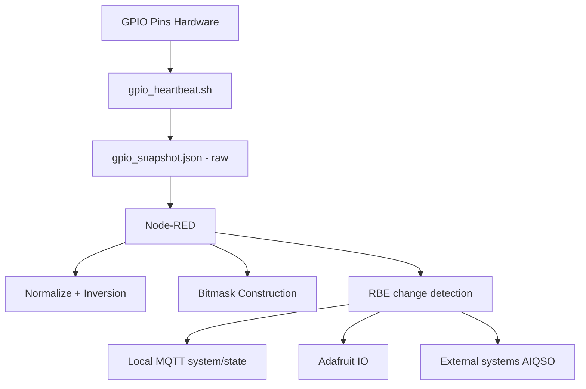

# Data Flow

## Digital Path

GPIO
 → chkgpio.py
 → MQTT
 → Node-RED
 → InfluxDB
 → Grafana

## Snapshot Path

GPIO
 → gpio-heartbeat.sh
 → /run/gpio_snapshot.json
 → (consumer TBD)

## Digital State Data Flow

## Analog Path

Level Sensor (4–20mA)
 → ADS1115
 → level-gem2.py
 → MQTT
 → Node-RED
 → InfluxDB
 → Grafana
